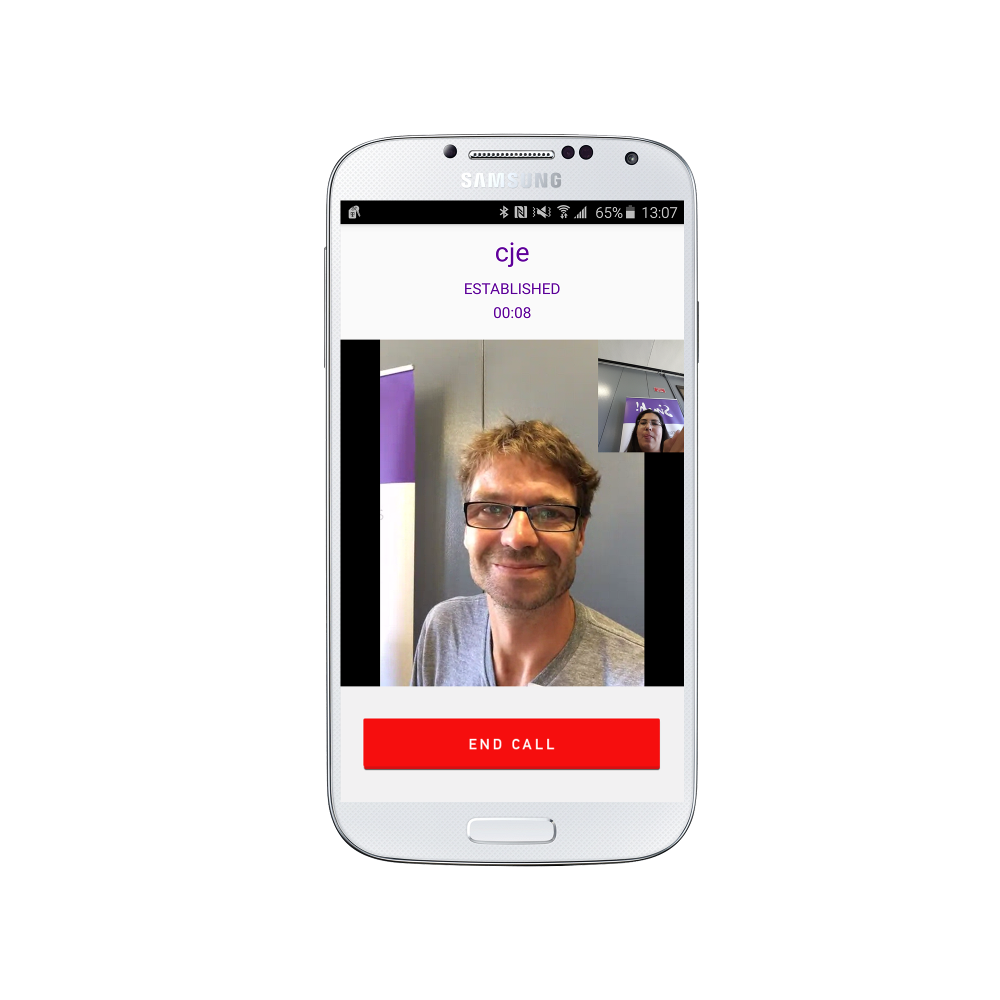

# Building an Android Video Calling App

One of the things successful social apps have in common is continuously adding multimedia, providing users with everything they could possibly need to improve conversations. As the social app market saturates and competition toughens, [rich and native communication is the secret sauce] (https://www.sinch.com/opinion/stats-says-now-perfect-time-add-communication-app/) to user retention. And video is the special ingredient.

This tutorial will walk you through building a simple Android Video Calling app that will look like this:

The completed source code for this tutorial is available at [GitHub](https://github.com/sinch/android-video-calling).

## Setup
Create a new project in Android Studio. You can use Eclipse if preferred, but this tutorial was built and tested in Android Studio.

Next, create an app in the [Sinch Dashboard](https://www.sinch.com/dashboard/#/signup). Name the app with your title of choice and click "Create."

Take note of your key and secret for this app, you'll be needing it in a few minutes.

Download the Sinch Android SDK at [www.sinch.com/downloads](https://www.sinch.com/downloads/). To add the Sinch SDK to your project:

1. Copy the entire libs folder to your project’s root directory
2. Right-click the jar-files and choose “Add As Library”
4. Create a new folder under src/main and name it jniLibs
5. Move the x86, armeabi and armeabi-v7a folders into the newly created jniLibs folder

In the AndroidManifest.xml file add the following permissions:

```
<uses-permission android:name="android.permission.INTERNET" />
<uses-permission android:name="android.permission.ACCESS_NETWORK_STATE" />
<uses-permission android:name="android.permission.RECORD_AUDIO" />
<uses-permission android:name="android.permission.MODIFY_AUDIO_SETTINGS" />
<uses-permission android:name="android.permission.READ_PHONE_STATE" />
```

## Login

Now that we have our video call setup, we can add the login.

Create the login.xml layout with a text edit and button.

```
<EditText
        android:id="@+id/loginName"
        android:layout_width="match_parent"
        android:layout_height="wrap_content"
        android:layout_marginTop="8dp"
        android:inputType="textPersonName"
        android:textSize="32sp"
        android:padding="10dp"
        android:textColor="@color/sinch_purple"
        android:background="@drawable/inputbox">

    <requestFocus/>
</EditText>

<Button
      android:id="@+id/loginButton"
      android:layout_width="wrap_content"
      android:layout_height="wrap_content"
      android:layout_marginBottom="40dp"
      android:layout_gravity="center_horizontal"
      android:background="@drawable/button_login"
      android:minHeight="56dp"
      android:minWidth="132dp"
      android:textColor="@color/off_white"
      android:textSize="22sp"
      android:textStyle="bold" android:layout_alignParentBottom="true" android:layout_centerHorizontal="true"/>
```

Going back to LoginActivity.java add on the loginClicked event

```
private void loginClicked() {
        String userName = mLoginName.getText().toString();

        if (userName.isEmpty()) {
            Toast.makeText(this, "Please enter a name", Toast.LENGTH_LONG).show();
            return;
        }

        if (!getSinchServiceInterface().isStarted()) {
            getSinchServiceInterface().startClient(userName);
            showSpinner();
        } else {
            openPlaceCallActivity();
        }
    }
```

On the CallScreenActivity we'll have the onCreate function include content view, audio, name and state of the video call.

```
protected void onCreate(Bundle savedInstanceState) {
        super.onCreate(savedInstanceState);
        setContentView(R.layout.callscreen);

        mAudioPlayer = new AudioPlayer(this);
        mCallDuration = (TextView) findViewById(R.id.callDuration);
        mCallerName = (TextView) findViewById(R.id.remoteUser);
        mCallState = (TextView) findViewById(R.id.callState);
        Button endCallButton = (Button) findViewById(R.id.hangupButton);

        endCallButton.setOnClickListener(new OnClickListener() {
            @Override
            public void onClick(View v) {
                endCall();
            }
        });
        mCallStart = System.currentTimeMillis();
        mCallId = getIntent().getStringExtra(SinchService.CALL_ID);
    }
```

## Setting up a Video Call

Just like audio calls, video calls are placed through the CallClient and events are received using the CallClientListener. The call client is owned by the SinchClient and accessed using sinchClient.getCallClient(). Calling is not enabled by default.

Once you have created a VideoCallListener and added it to a call, the onVideoTrackAdded() method will be called.

```
@Override
    public void onVideoTrackAdded(Call call) {
        // Get a reference to your SinchClient, in the samples this is done through the service interface:
        VideoController vc = getSinchServiceInterface().getVideoController();
        View myPreview = vc.getLocalView();
        View remoteView = vc.getRemoteView();

        // Add the views to your view hierarchy
        ...
    }
```

Once the call has ended remove Sinch views from your screen.

```
@Override
 public void onCallEnded(Call call) {
     CallEndCause cause = call.getDetails().getEndCause();
     Log.d(TAG, "Call ended. Reason: " + cause.toString());
     mAudioPlayer.stopProgressTone();
     setVolumeControlStream(AudioManager.USE_DEFAULT_STREAM_TYPE);
     String endMsg = "Call ended: " + call.getDetails().toString();
     Toast.makeText(CallScreenActivity.this, endMsg, Toast.LENGTH_LONG).show();

     endCall();
 }
 ```

## Making Outgoing Calls

Create the callscreen.xml and add a call button.

```
<RelativeLayout
      android:id="@+id/bottomPanel"
      android:layout_width="match_parent"
      android:layout_height="0dp"
      android:background="@color/greyish"
      android:layout_weight="1">
  <Button
          android:id="@+id/hangupButton"
          android:paddingBottom="20dp"
          android:paddingTop="20dp"
          android:layout_width="wrap_content"
          android:layout_height="wrap_content"
          android:layout_centerInParent="true"
          android:background="@drawable/button_end"/>

</RelativeLayout>
```

Now we'll create a PlaceCallActivity where the user will be able to place a call by inputting the user's name.

```
private void callButtonClicked() {
      String userName = mCallName.getText().toString();
      if (userName.isEmpty()) {
          Toast.makeText(this, "Please enter a user to call", Toast.LENGTH_LONG).show();
          return;
      }

      Call call = getSinchServiceInterface().callUser(userName);
      String callId = call.getCallId();

      Intent callScreen = new Intent(this, CallScreenActivity.class);
      callScreen.putExtra(SinchService.CALL_ID, callId);
      startActivity(callScreen);
  }
```

Make sure you have added your application secret and key in the SinchService file.

1. To test a video call you will need another device and create a different user
2. Create User1 on device1 and User2 on device2
3. User1 types in User2's username and click Call
4. User2 receives incoming call from User1 and clicks answer
5. Now User1 and User2 are video chatting! Either party can click Hang Up to end the video call.

## Receiving Incoming Calls

For demo purposes the app will automatically accept incoming calls. Create the IncomingCallScreenActivity and instantiate the onCreate method.

```
@Override
   protected void onCreate(Bundle savedInstanceState) {
       super.onCreate(savedInstanceState);
       setContentView(R.layout.incoming);

       Button answer = (Button) findViewById(R.id.answerButton);
       answer.setOnClickListener(mClickListener);
       Button decline = (Button) findViewById(R.id.declineButton);
       decline.setOnClickListener(mClickListener);

       mAudioPlayer = new AudioPlayer(this);
       mAudioPlayer.playRingtone();
       mCallId = getIntent().getStringExtra(SinchService.CALL_ID);
   }
```
And to answer the call we'll set answerClicked to get the SinchService CALL_ID.   

```
private void answerClicked() {
        mAudioPlayer.stopRingtone();
        Call call = getSinchServiceInterface().getCall(mCallId);
        if (call != null) {
            call.answer();
            Intent intent = new Intent(this, CallScreenActivity.class);
            intent.putExtra(SinchService.CALL_ID, mCallId);
            startActivity(intent);
        } else {
            finish();
        }
    }
```

That's all for now folks! As you know, we're happy to continue talking to you on Twitter @SinchDev or email dev@sinch.com.
